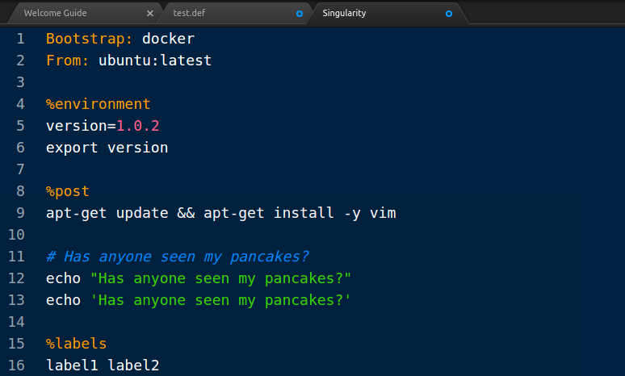

# Singularity Language

This repository provides a small package to help with syntax highlighting of
Singularity recipe files in the Atom editor. The package is [published on apm](https://atom.io/packages/language-singularity) and can be updated as needed.

 - [Grammars](grammars): contains the definition of rules and highlights, with details provided below.
 - [Settings](settings): additional settings 

The files that are "sniffed" and determined to be Singularity include "Singularity" in
the name or (less common) end with `.def`. The syntax is fairly simple thus far, and
looks like this:

Please contribute by issuing a pull request to this repository!

## How to develop
The package itself, as an "official package," should be published, but you
can easily clone this repository and put it in your `$HOME/.atom/packages` folder
(and maintain the name starting with `language-` to have it be discovered. You
should likely restart your editor, and then save a file that ends in `def` or has
`Singularity`.

## Acknowledgements
Most of the guidance for the regular expressions is taken from [language-docker](https://github.com/jagregory/language-docker) that has very similar syntax highlighting.
